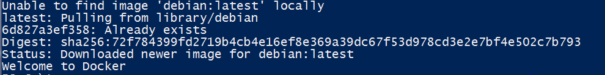
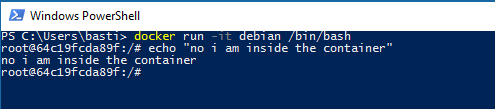
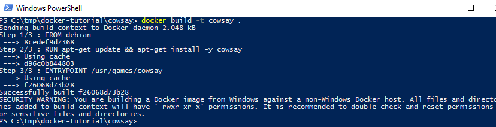
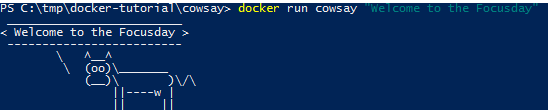
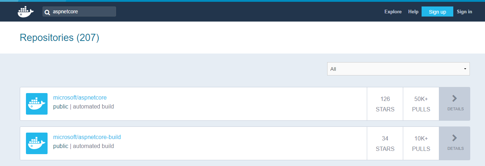
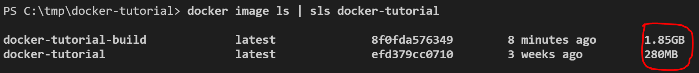
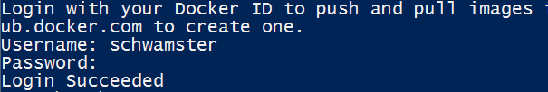
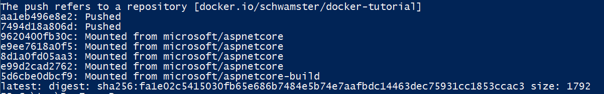

# Docker Tutorial with asp.net core

This is related to [this post on devt.to](https://dev.to/schwamster/docker-tutorial-with-for-aspnet-core)
In this tutorial, you will learn how to build and run your first asp.net core docker image. We start of with a very short general docker introduction.
After that we choose the "right" images. We will first create a docker container that is responsible for building our source files. For that we copy our source files to the build container. When the build is done we will copy the published project back to the host system and create a runtime image. After that we explore the handy additon "multi-stage" build to simplify the build.

Your will need to install [dotnet core](https://www.microsoft.com/net/core) and [docker](https://docs.docker.com/engine/installation/) on your machine before your begin this tutorial.

If you are running behind a proxy some of the commands might not work, so be sure to check out the [Proxy-Section](#proxy) below.

## The Dockerfile

If you already have basic knowledge of Docker skip this introduction and go straight to [Choose an image](#choose_image).

You can run one of the many images that exist ready for usage on [hub.docker.com](https://hub.docker.com). You can for example
run a command on an instance of Debian a popular Linux Distro with the following command:

```powershell
docker run debian echo "Welcome to Docker"
```




This might take a while the first time, since docker has to pull the image. A second run should start the command in a fraction of a second.

Instead of running a "throw away"-container you can also use an container interactively like so:

```powershell
docker run -it debian /bin/bash
```



Check out the docker run reference to find out more: [docker run](https://docs.docker.com/engine/reference/run/)

You can exit the container by typing "exit" and hitting enter.

But you can not only run other peoples images, you can also create your own images. For that you will need to create a *Dockerfile*. The *Dockerfile* describes an image and all its dependencies in steps.

We can start with a simple Dockerfile that extends our hello world example.

Create a new folder called cowsay and add a file called Dockerfile. Add the following content to the file:

```dockerfile
FROM debian

RUN apt-get update && apt-get install -y cowsay

ENTRYPOINT ["/usr/games/cowsay"]
```

In this dockerfile we are doing the follwing:

1. defining what base image we want to use => debian
2. running a command in the image that updates the packagemanager and installs an app called cowsay
3. defining what app to run when the image is run

For a full reference of the available instructions in Dockerfile go here [Dockerfile](https://docs.docker.com/engine/reference/builder/)

Now let's build the image with the build command from the created folder:

```powershell
docker build -t cowsay .
```

If this hangs and you are running behind a proxy check [this](#proxy) out.



Now that we have build our image we can run it:

```powershell
docker run cowsay "Welcome to Docker"
```



## Choose an image<a name="choose_image"></a>

Go to [hub.docker.com](https://hub.docker.com) and search for  aspnetcore
You will find many different choices. If there are no very special reasons i would opt for official images or images uploaded by the involved companies. Two images are interesting:



There are two different images provided by microsoft. One of them only contains the runtime and the other contains the SDK as well - see the following descriptions

### ASP.NET Core Docker Image
This repository contains images for running **published** ASP.NET Core applications. These images use the
microsoft/dotnet image as its base.

### ASP.NET Core Build Docker Image
This repository contains images that are used to **compile/publish** ASP.NET Core applications inside the container. This is different to compiling an ASP.NET Core application and then adding the compiled output to an image, which is what you would do when using the microsoft/aspnetcore image. These Dockerfiles use the microsoft/dotnet image as its base.

## Create a asp.net core project

create a folder called docker-tutorial and navigate to it, then execute the following command:

```powershell
dotnet new webapi
```

## First Build

Let's start easy and compile the app on our computer and then add the output to the runtime image.

Run the following commands in the root of your project:

```powershell
dotnet restore
dotnet publish -o ./publish
```

You should now have a publish folder, that contains your compiled application.

Now create a new Dockerfile in the root of the application

```dockerfile
FROM microsoft/aspnetcore:2.0
WORKDIR /app
COPY ./publish .
ENTRYPOINT ["dotnet", "docker-tutorial.dll"]
```

This Dockerimage will copy the contents of the publish folder in the root of your project into the app folder on the image.

Build the image:

```powershell
docker build -t docker-tutorial .
```

You can find out more about the build command [here](https://docs.docker.com/engine/reference/commandline/build/)

Test the image:

```powershell
docker run -p 8181:80 docker-tutorial
```

Now you can navigate to the hosted application: http://localhost:8181/api/values

You should get a response like this:

```json
["value1","value2"]
```

Your docker engine might not be reachable through localhost. If so change to the correct url. If you
are using the docker toolbox with docker-machine you can get the ip with the following command:

```powershell
docker-machine ip default
```

## Compiling within the aspnetcore-build image

It is recommended to compile your project within the docker image, since this will produce a more reliable build pipeline. The build on the development machine will work the same way as the build in the build server.

So let's create another Dockerfile called Dockerfile.build

```dockerfile
FROM microsoft/aspnetcore-build:2.0
WORKDIR /app

COPY *.csproj .
RUN dotnet restore

COPY . .
RUN dotnet publish --output /out/ --configuration Release
```

The new instruction we use here is *COPY*. This copies files from our host into the image.
Also note what happens when you rebuild the image. If you don't change anything nothing will be done. If you change something in the code the publish instruction will be executed but not *dotnet restore*. Only if you change some dependency will the *dotnet restore* instruction be executed.
For a more detailed description of this "layered" build process check [this](https://docs.docker.com/engine/userguide/storagedriver/imagesandcontainers/) out.

Before we build the "build-image" we need to add one more file to avoid that dotnet commands on our host (dotnet restore/build/publish) interfere with the build context. See [this](https://codefresh.io/blog/not-ignore-dockerignore/) for more information. Add a file called .dockerignore with the following content to the root of the project:

```txt
bin
obj
publish
```

Now let's build the image. Note we have to explicitly specify what Dockerfile we want to use:

```powershell
docker build -f Dockerfile.build -t docker-tutorial-build .
```

We have now build the app in the image. We could now run the container from that image but run the follwoing command first:

```powershell
docker image ls | sls docker-tutorial
```



As you can see the build image is dramatically larger than the image we created before. This is because the build images has absolutley everything you need to build your images (SDK). We don't need that when we run our container. The solution is to create a runtime image.

So next step is to get the compiled app out of the build image. First we create the container with the [create](https://docs.docker.com/engine/reference/commandline/create/) command. This is almost like *docker run* just that the container is never really started. We can however copy out the compiled app.

```powershell
docker create --name docker-tutorial-build-container docker-tutorial-build
```
! delete the earlier created publish folder - we will now copy the containers compiled result into that folder:

```powershell
docker cp docker-tutorial-build-container:/out ./publish
```

Great now we can build the runtime image just like before:

```powershell
docker build -t docker-tutorial .
```

And of course run it:

```powershell
docker run -p 8181:80 docker-tutorial
```

! You probably have to stop the container we started earlier, since that one is already using port 8181. To do so first list the running processes:

```powershell
docker ps
```

Copy the container ID, e.g. ba51e5dc4036

and run the following command:

```powershell
docker rm $(docker stop ba51e5dc4036)
```

# Multi-Stage Builds

With Docker Version 17.05 we got a new featuer that makes the build process much easier. The reason we have a build image and a runtime images is, 
because we want a slimer image at runtime. Since this is a very common requirement for a lot of languages Docker provided us with multi-stage
builds => [see documentation](https://docs.docker.com/engine/userguide/eng-image/multistage-build/). This means we can now define build and runtime image in one single Dockerfile and we can copy the produced binaries from the build image into 
our runtime image.

First stop the container if it is still running:

```powershell
docker stop $(docker ps --filter "ancestor=docker-tutorial" -q)
```

Add a new Dockerfile with the name Dockerfile.multistage with the following content:

```dockerfile
# build image
FROM microsoft/aspnetcore-build:2.0 as build
WORKDIR /app

COPY *.csproj .
RUN dotnet restore

COPY . .
RUN dotnet publish --output /out/ --configuration Release

# runtime image
FROM microsoft/aspnetcore:2.0
WORKDIR /app
COPY --from=build /out .
ENTRYPOINT [ "dotnet", "docker-tutorial.dll" ]
```

Building the image is now much easier. All you got to do is to run the follwing:

```powershell
docker build -f .\Dockerfile.multistage -t docker-tutorial .
```

Check the image size of the image again:

```powershell
docker image ls | sls docker-tutorial
```

The resulting runtime image still has the much smaller footprint, since the intermediate images in a multi-stage build dont make it into the resulting image.

Run it:

```powershell
docker run -p 8181:80 docker-tutorial
```

Great! Now we massivly simplified the build process and still kep the image small! At this point I would get rid of the existing Dockerfile and Dockerfile.build and rename Dockerfile.multistage to Dockerfile. Then the build command looks like this:

```powershell
docker build -t docker-tutorial .
```

# Publishing & Pulling Images

Now that we build the image it would be nice if we could use that on other docker hosts. To do so we can upload our image to a docker registry.
There are many different choices for docker registries: hub.docker.com, AWS ECR, Artifactory...
For simplicity we will be using hub.docker.com which is free for public images.

If you havent done so yet, [create an account ](https://hub.docker.com/).

You can then logon in powershell:

```powershell
docker login
```



To be able to upload (push) our image we have to prefix our image with our username. My username is schwamster so I would have to run the following command:

```powershell
docker tag docker-tutorial schwamster/docker-tutorial
```

Now I can push the image

```powershell
docker push schwamster/docker-tutorial
```



After the image is pushed I can verify that it worked by opening the following url: [https://hub.docker.com/r/schwamster/docker-tutorial/](https://hub.docker.com/r/schwamster/docker-tutorial/)

To pull the image run the following command:

Now you can also run my image like this:

```powershell
docker run -p 8182:80 schwamster/docker-tutorial
```

My image will now be pulled and run on your machine. Check it out under http://localhost:8182/api/values  (Changed port to 8182)

# Proxy<a name="proxy"></a>

If you are forced to go through a proxy you will have to adjust some of the commands we used above. 

## Proxy and docker run

If you need to have internet access from within your container you will have to add the proxy settings to respective environment variables of the container instance. Those can be different depending on what application you use. In general I would set the following:

* http_proxy
* https_proxy

I noticed that some applications want the variables to be set uppercase -> HTTP_PROXY, HTTPS_PROXY. Other apps might need dedicated environment variables or even changes in config files.

To add the proxy environment variables add each environment variable with the [-e argument](https://docs.docker.com/engine/reference/run/#env-environment-variables) 

Here is an example:

```powershell
docker run -it -e https_proxy=http://someproxy:8080 -e http_proxy=http://someproxy:8080 debian /bin/bash
```

To test this run the following command in your container:

```bash
apt-get update
```

apt-get update should now work and not run into a timeout.

## Proxy and docker build

If you need internet access while building the image you need to pass the environment variables with the [--build-arg argument](https://docs.docker.com/engine/reference/builder/#arg) just like you do it with run time environment variables. Its just the argument that is called different.

Example:

```powershell
docker build --build-arg http_proxy=http://someproxy:8080 --build-arg https_proxy=http://someproxy:8080 -t cowsay .
```

 


# Acknowledgement

Please check out this great [book](http://shop.oreilly.com/product/0636920035671.do) "Using Docker" by Adrian Mouat  (O´Reilly) ISBN 978-1-491-91576-9
